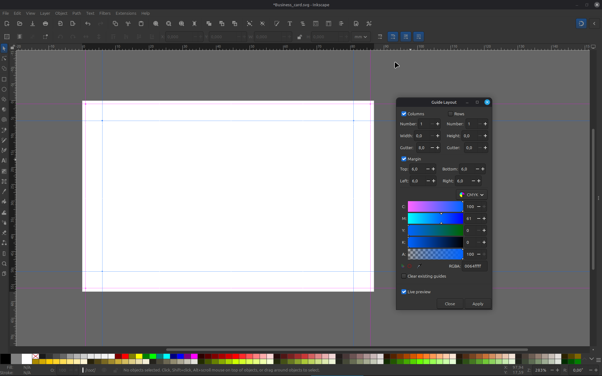
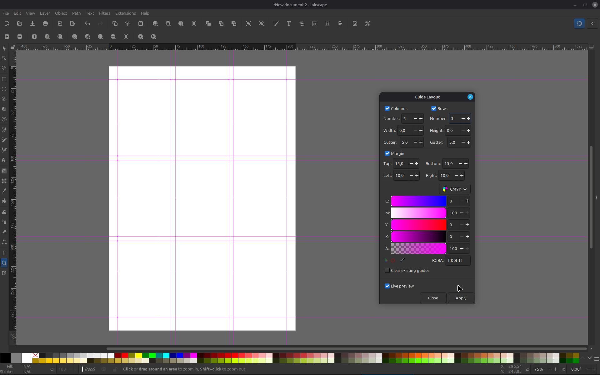

# Guide Layout

**Guide Layout** is a free, open-source Inkscape extension that generates real, snappable guides (not rectangles, not drawn lines) using a simple, checkbox-driven interface inspired by Photoshop's "New Guide Layout" dialog.

It was built as a lightweight alternative to Inkscape's built-in **Guides Creator** extension.

## Why

Inkscape's built-in Guides Creator is powerful, but it can be overwhelming for newer users: multiple tabs (Regular guides / Diagonal guides / Margins), preset dropdowns, fraction-based margins, and book-layout presets that assume prior knowledge of editorial terminology.

Guide Layout takes the opposite approach: **one flat panel, plain language, sensible defaults.** If you've used Photoshop's guide dialog, you already know how to use this.

## Features

- **Columns and Rows are independent checkboxes.** Enable one for a simple column or row grid, or both at once for a modular grid — no separate "grid type" dropdown to figure out.
- **Auto or fixed sizing.** Leave Width/Height at `0` and columns/rows automatically fill the available space. Enter a value greater than `0` for a fixed size — the block anchors to the top-left, leaving any extra space on the right/bottom (matching Photoshop's default behavior).
- **Independent Margin toggle.** Margins only take effect when the Margin checkbox is enabled. When enabled, margin guides are created even if Columns/Rows are off, and column/row edges align with the margin without creating duplicate guides.
- **Unit-aware.** All values (Margin, Gutter, Width, Height) are interpreted in whatever measurement unit your document is set to (px, mm, cm, in, etc.) — no manual conversion needed.
- **Custom guide color**, applied via Inkscape's native guide coloring (visible when right-clicking a guide → Guide Properties).
- **Clear existing guides**, to remove previously created guides before generating a new layout — no manual cleanup needed between attempts.
- **Real Inkscape guides only.** Nothing is drawn on the canvas — no rectangles, no paths, no extra layers left behind. Everything created is a standard `sodipodi:guide`, draggable and snappable like any guide you'd pull from the ruler yourself.
- **Live preview** support, using Inkscape's native extension preview.

  

## Requirements

- Inkscape **1.0 or later** (uses the modern `inkex` Python API).

## Installation

1. Download `guide_layout.py` and `guide_layout.inx`.
2. Copy both files into your Inkscape user extensions folder:
   - **Linux:** `~/.config/inkscape/extensions/`
   - **macOS:** `~/Library/Application Support/org.inkscape.Inkscape/config/inkscape/extensions/`
   - **Windows:** `%APPDATA%\inkscape\extensions\`

   (You can also find the exact path via **Edit > Preferences > System > User extensions** inside Inkscape.)
3. Restart Inkscape completely.
4. The extension appears under **Extensions > Render > Guide Layout**.

## Usage

Open **Extensions > Render > Guide Layout** with a document open. The dialog has three sections:

### Columns / Rows
- **Number** — how many columns/rows to create.
- **Width / Height** — `0` fills the available space automatically; any value greater than `0` creates a fixed size, anchored to the top-left.
- **Gutter** — spacing between columns/rows.

Enable **Columns** alone for a column grid, **Rows** alone for a row grid, or both together for a modular grid.

### Margin
Unchecked by default. When enabled:
- **Top / Bottom / Left / Right** define the margin on each side.
- Margin guides are created on any edge with a value greater than `0`.
- If Columns/Rows are also enabled, their guides are positioned within the margin instead of the full page.

### Guide color & Clear existing guides
- **Guide color** sets the color applied to every guide created (the alpha/transparency slider has no visual effect on guides and can be ignored).
- **Clear existing guides** removes all guides currently on the page before creating the new set.

## Known limitations

- Works on the currently active page only; documents using Inkscape's multi-page feature are not yet supported.
- The guide color picker includes an alpha channel for consistency with Inkscape's standard color widget, but transparency has no effect on guides.

## License

GNU General Public License v3.0 (or later). See the license header in `guide_layout.py` for details.

## Author

Created by **Tatudesigner** ([tatudesigner@gmail.com](mailto:tatudesigner@gmail.com)), also the author of [Design Grid](https://github.com/tatudesigner/Design-Grid-Extension-for-Inkscape).

## Feedback

This project is under active development — bug reports, feature suggestions, and general feedback are welcome via GitHub issues.
